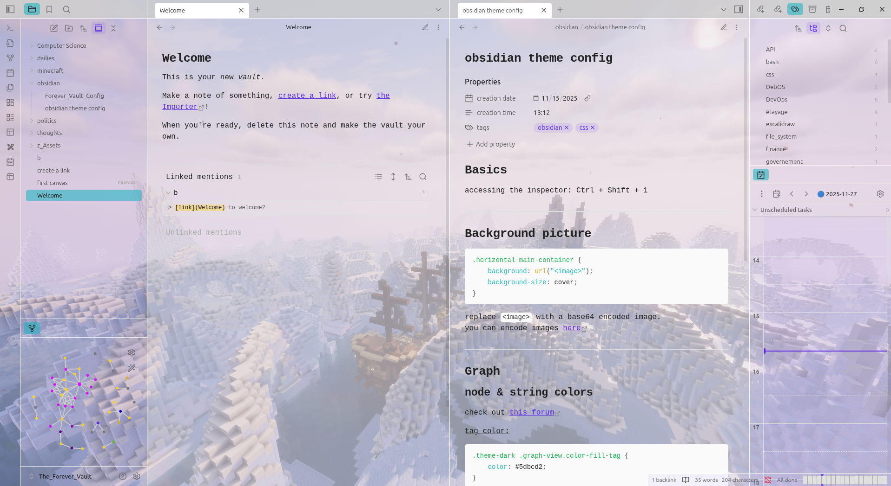
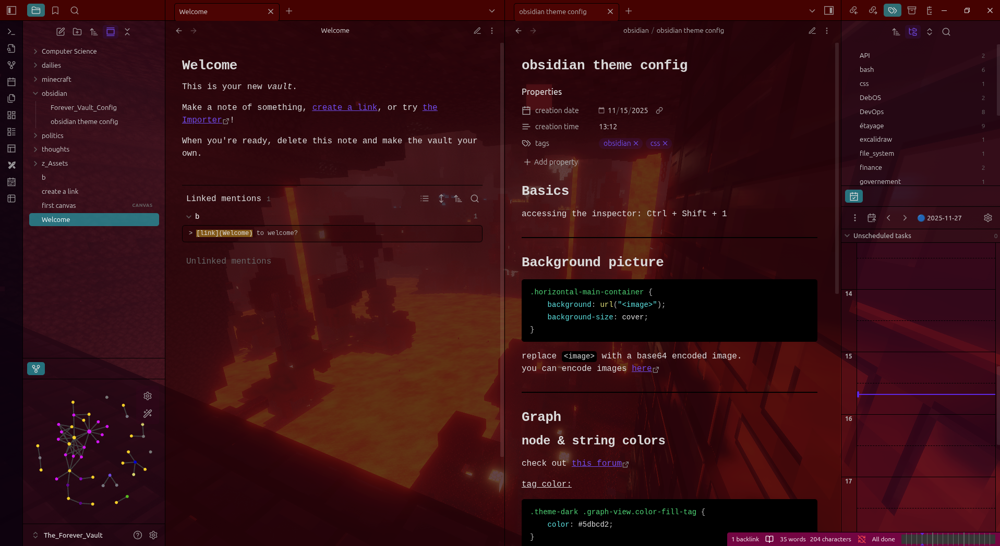

# ObsiCraft
My obsidian theme based on minecraft.
The aim of this theme is, obviously, to be themed after minecraft but also to simplify the customization of obsidian.

> [!note]
> This is my first time really working with css
> so don't expect super clean files but you can expect comments a bit everywhere

> [!important]
> You might notice how abnormally heavy the css file is.
> more info on that in the **[background images section](#background-images)**


## Table of contents
- [Light theme](#light-theme)
- [Dark theme](#dark-theme)
- [Simplified customization](#how-i-try-to-simplify-the-customization)
    - [Relative colors](#relative-colors)
    - [More color vars](#more-color-variables)
- [Additional notes](#additional-notes)
    - [background images](#background-images)
- [Using this theme](#using-this-theme)

# Light theme



# Dark theme



# How i try to simplify the customization

## Relative colors

I use relative colors where i know i can so there are as little color variables to change as possible to make everything fit together.

> [!tip]
> if you don't know what are or how to use relative colors, i think **[this guide](https://developer.mozilla.org/en-US/docs/Web/CSS/Guides/Colors/Using_relative_colors)** explains it well.

### Examples of how i use relative colors:

this is how the settings menu stays the same color as the editor just losing the transparancy so you can see something.
```css
.theme-light {
    --background-primary:  #ebebeb2a;
    /* ...some lines... */
    --modal-background: rgb(from var(--background-primary) r g b / 1 );
}
```

## more color variables

> [!tip]
> all (or most) color variables exist in both theme dark and theme light

<details><summary>all color variables added so far</summary>

- --cmd-prompt-input
- --cmd-prompt-results
- --cmd-prompt-instructions

</details>

# additional notes

Some of the added variables listed in **[more color variables](#more-color-variables)** may be useless due to obsidian already having color variables for the exact same thing but if you find that is the case then it means i was not aware of it and a heads up would be appreciated.

I know theme.css is super messy right now and doesn't even make use of relative colors as much as it can.
Again, this them is still very early in the making and it's my first time working with css so it's going to take time.

## background images

The background images are encoded in base64 inside [theme.css](./theme.css) so you can be offline and still see them when using obsidian

there are 2 images, 1 for light, 1 for dark.
you can find them under everything else in [theme.css](./theme.css)

for light theme background image:
```css
.theme-light .horizontal-main-container {
    background: url("<encoded image>");
    background-size: cover;
}
```

for dark theme background image:
```css
.theme-dark .horizontal-main-container {
    background: url("<encoded image>");
    background-size: cover;
}
```

for 1 image on both theme (remove the other 2 images in this case):
```css
.horizontal-main-container {
    background: url("<encoded image>");
    background-size: cover;
}
```

> ![tip]
> To easily encode your image, you can use **[this free website](https://it-tools.tech/base64-file-converter)** which requires no login mail or whatever
> just copy the result and replace `<encoded image>` from the above snippets.

# Using this theme

Download `theme.css` and `manifest.json` into a folder called `ObsiCraft`.
then move this folder in the theme folder of your desired vault, this path should be something like:
`~/some/folders/Your_vault/.obsidian/themes/`

in the end, the file tree of your vault should look something like:
```bash
Your_Vault #<--------------------- Your Vault
├── some_files
├── some_folders
├── .obsidian #<------------------ Hidden .obsidian folder
│   ├── appearance.json
│   ├── some_files
│   ├── snippets
│   │   └── some_snippets
│   ├── plugins
│   │   └── some_plugins
│   ├── themes #<------------------ Theme folder
│   │   └── ObsiCraft #<----------- ObsiCraft theme folder you downloaded
│   │       ├── manifest.json
│   │       └── theme.css
```
Hope you like it :)
